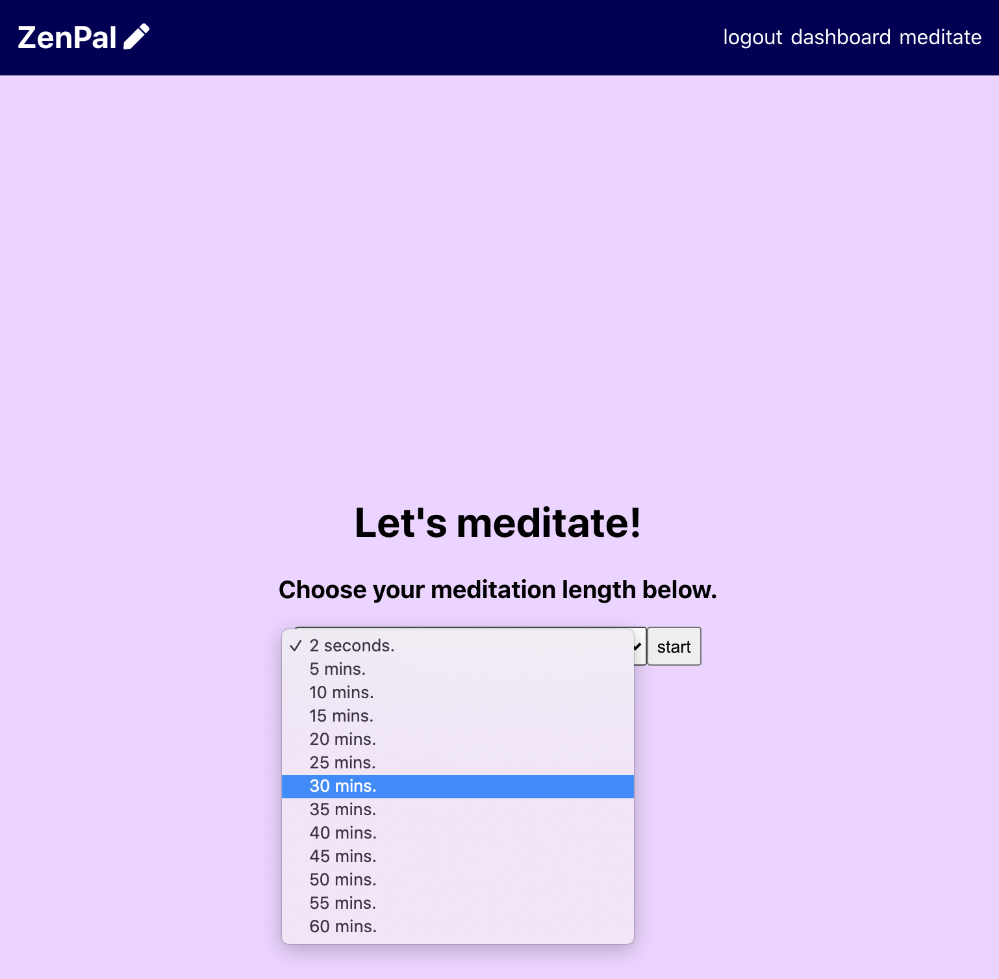
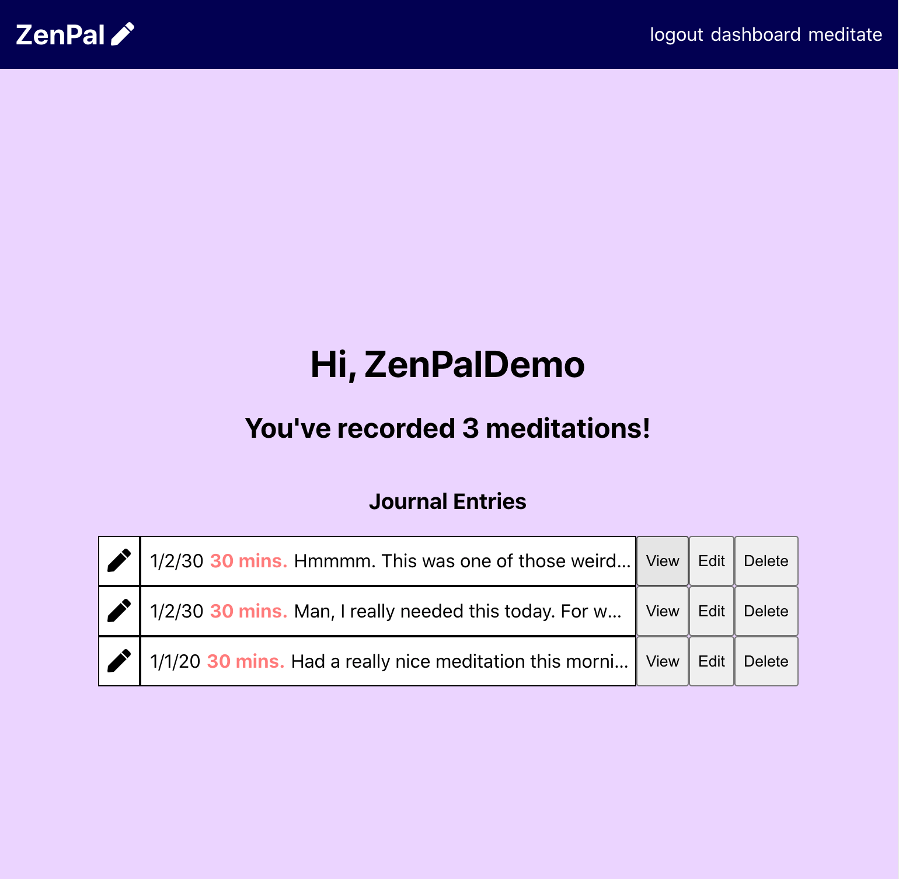

# ZenPal

**Live:** https://zenpal-nfwfgu6uj.vercel.app/

## Description:

ZenPal makes it easy for you to time and reflect on your daily meditations!
Simply head to the "meditate" section, select a time length, and begin your practice. A singing bowl will ring when your time is up and you will be greeted with a blank page to journal your experience in. You can also easily browse through your recorded entries and be amazed at the progress you've made with your practice.

## Login Credentials:

Username: ZenPalDemo 
Password: ZenPalDemo1!

## Your First Meditation:

Once logged in, click on "meditate" in the naigation bar. Choose the amount of time you'd like to meditate, then click "start." Your timer will begin counting down, and once it finishes, you'll be signaled to end your practice by the sound of a singing bowl. When you open your eyes, you'll see a blank space in which you can record any reflections you have about your experience. Your journal entry will be saved in te ZenPal database for you.

## Navigating Your Journal:

To view a record of your journal entries, click "dashboard" in the navigation bar. Here you'll see a list of each journal entry you've submitted to the database. If you set a timer for your meditation but did not enter a journal entry, you can find a record for that as well. The buttons to the right of each item in the list allow you to either view your journal entry in its entirety, edit your entry, or delete it. If you click the "delete" button, a warning message will appear and give you the choice to confirm the deletion or not.

## Technology Used:

**HTML5, CSS3, JavaScript, React, Node.js, Express, Postgres**
